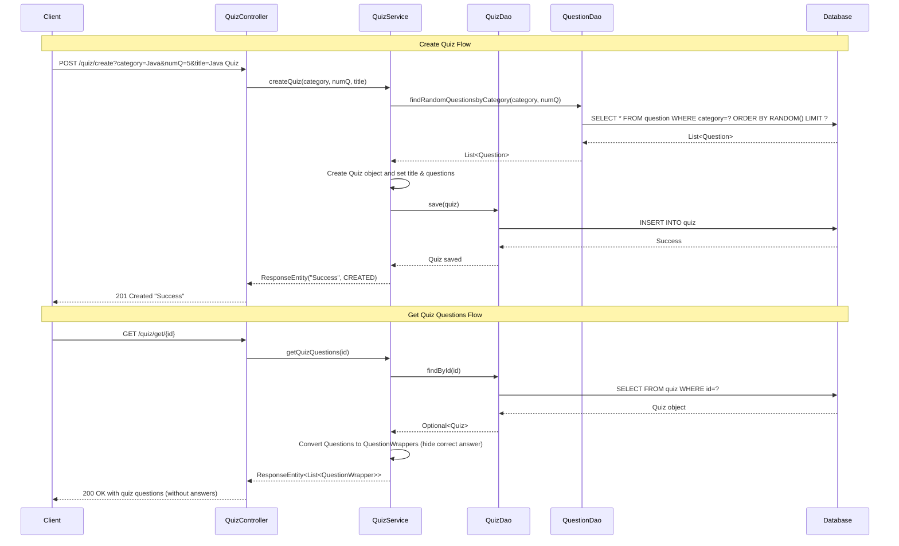

# Quiz App Backend

A REST API for creating and managing quizzes, built with Spring Boot. This project was my first dive into enterprise Java development after working with frontend JavaScript, helping me understand how backend systems work and how data flows through real applications.

## Features

- **Question Management**: Store quiz questions with multiple choice answers in a database
- **Custom Quiz Creation**: Generate quizzes by category using random question selection
- **Secure Question Serving**: Serve questions without revealing correct answers to prevent cheating
- **RESTful API**: Clean endpoints for managing questions and quizzes
- **Database Relationships**: Proper data modeling using JPA annotations

## Tech Stack

- **Spring Boot** - Enterprise Java framework
- **Spring Data JPA** - Database operations (eliminates manual SQL writing)
- **PostgreSQL/H2** - Database storage
- **Lombok** - Reduces boilerplate code
- **Maven** - Dependency management

## API Endpoints

### Questions
```
GET    /question/allQuestions        # Get all questions (admin use)
GET    /question/category/{category} # Filter questions by category
POST   /question/add                 # Add new questions
```

### Quizzes
```
POST   /quiz/create     # Create quiz with random questions from a category
GET    /quiz/get/{id}   # Get quiz questions (answers hidden from users)
```

## What I Learned

### Spring Framework
Coming from vanilla JavaScript, Spring initially felt overwhelming with all the annotations, dependency injection, and "magic" happening behind the scenes. However, once I grasped the core concepts, it dramatically accelerated API development compared to manual implementation.

### Database Relationships
The `@ManyToMany` relationship between Quiz and Question entities was challenging to understand initially. This project taught me about:
- JPA entity mapping
- How Spring automatically translates objects to database tables
- Proper relationship modeling


## Future Enhancements

- Implement answer submission and scoring system
- Add comprehensive input validation
- Integrate authentication and authorization
- Improve error handling and user feedback
- Add unit and integration tests
- Implement proper security measures

## System Architecture



---

*This project represents my journey from frontend JavaScript to backend Java development, focusing on understanding enterprise patterns and REST API design.*
